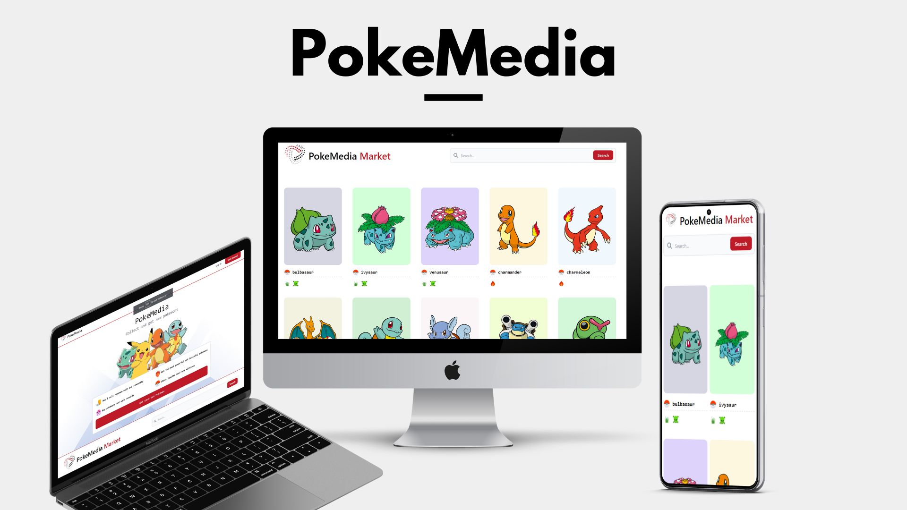

# PokeMedia

a simple yet beautiful web application to manage your pokemons.
<h4 align="center">
<br>
</h4>

**Live Demo**: **https://pokemedia.vercel.app/**

## Technologies
This project was developed with the following technologies:

- **React**: a library that allows the development of applications using JavaScript and React;
- **Typescript**: TypeScript is a superset for adding typesetting to JavaScript which aims to improve the development process by improving the IDE's intelliSense and preventing bugs.
- **Redux**: a predictable state container for JavaScript applications. It helps you write applications that behave consistently, run in different environments (client, server and native) and are easy to test; 
- **Redux Saga**: a library that aims to make application side effects easier to manage, more efficient to run, easier to test and better at handling crashes;
- **Axios**:  a Promises-based HTTP client for Browser and NodeJS;
- **Tailwind CSS**: a utility-first CSS framework for rapidly building custom user interfaces;
- **Headless ui**: Completely unstyled, fully accessible UI components, designed to integrate beautifully with Tailwind CSS;

## Getting Started

To run the project, you need: 

### Install dependencies
```
npm install
```

### Run The Project
```
npm start
```
Runs the app in the development mode.\
Open [http://localhost:3000](http://localhost:3000) to view it in the browser.

The page will reload if you make edits.\
You will also see any lint errors in the console.

### Run Tests
```
npm test
```
Launches the test runner in the interactive watch mode.\

